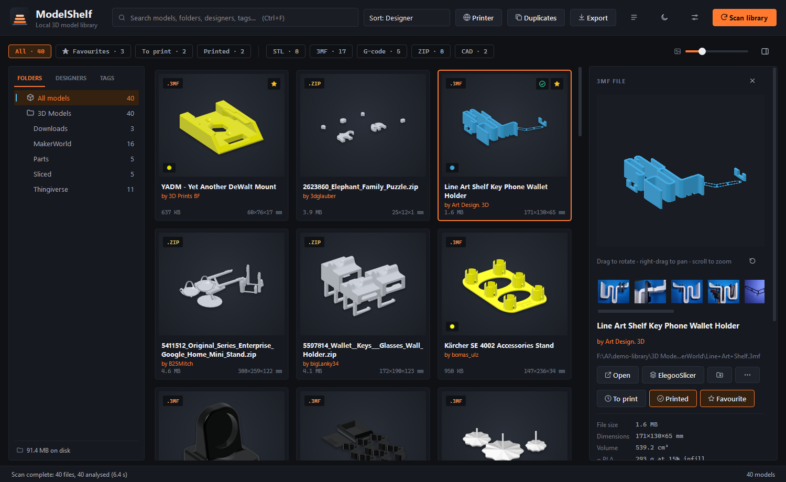
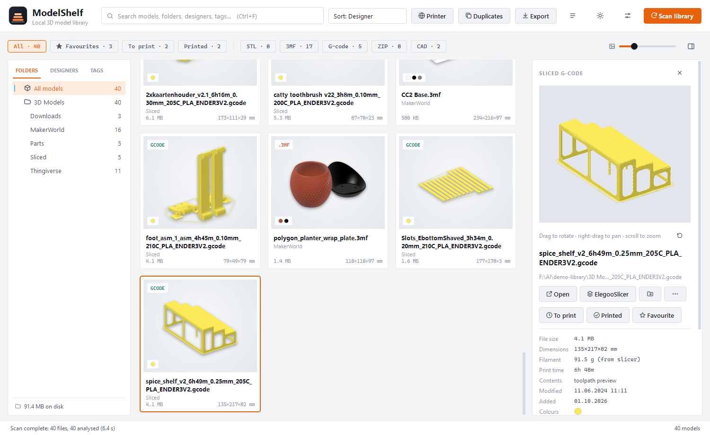
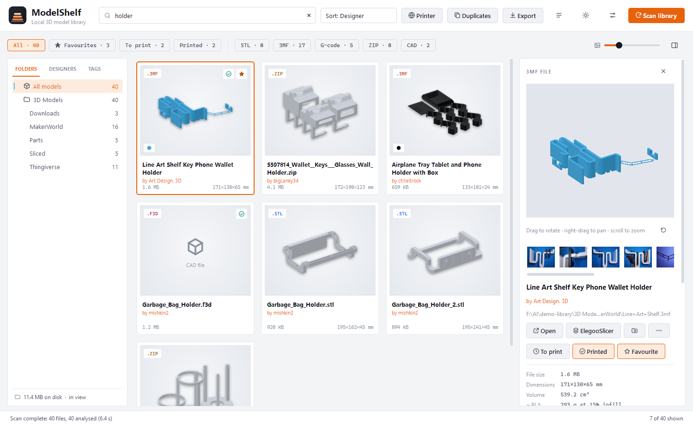
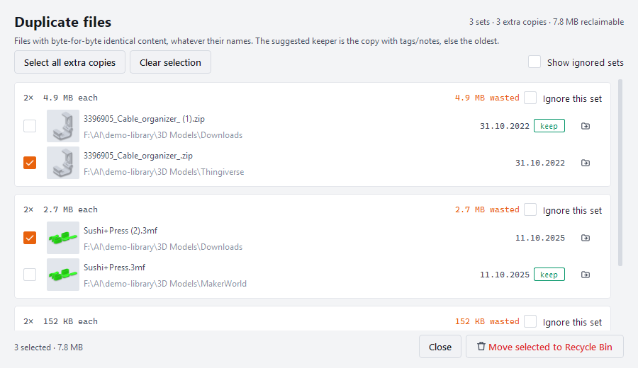
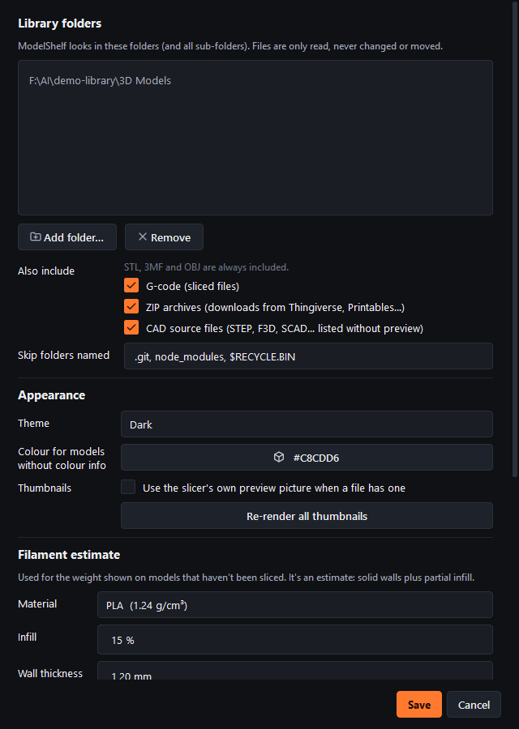

# ModelShelf

A local library for your 3D printing files. Point it at the folders where your
downloads pile up and it gives you thumbnails, search, tags and a real 3D
preview for every STL, 3MF, OBJ, G-code file and ZIP download.

Everything runs on your own PC. No account, no cloud, no uploads.



## Download

**[Download ModelShelf.exe](https://github.com/borgej/modelshelf/releases/latest/download/ModelShelf.exe)** (Windows 10 and 11, 64-bit)

It is a single file. There is nothing to install: save it anywhere and run it.
Older versions are on the [releases page](https://github.com/borgej/modelshelf/releases).

The build is not code signed, so Windows SmartScreen may show "Windows protected
your PC" the first time. Choose **More info** and then **Run anyway**.

## What it does

### See every model, not just file names

ModelShelf renders its own thumbnail for each file on your graphics card, so the
whole library looks consistent.

* **STL, 3MF and OBJ** are drawn as 3D models. 3MF files keep their filament
  colours, including multi-colour projects from Bambu Studio, OrcaSlicer and
  ElegooSlicer.
* **G-code** is drawn from the toolpath itself, so you see the actual print,
  along with print time and filament weight from the slicer.
* **ZIP downloads** from Thingiverse, Printables and MakerWorld show the models
  inside, without unpacking anything. ZIP files that contain no 3D files
  (drivers, installers and so on) are left out of the library.
* **CAD files** such as STEP, F3D and SCAD are listed so you can find them, but
  have no preview.

### A 3D preview you can turn around

Select a model to open the details panel. Drag to rotate, right-drag to pan and
scroll to zoom. Below it you get the photos that came with the download, the
size in millimetres, volume, an estimate of how much filament it needs, the
designer, and your own tags and notes.



### Find things again

* Search across file names, folders, designers, tags and notes. Put a minus in
  front of a word to exclude it, for example `holder -phone`.
* Filter by file type, favourites, your print queue or what you have already printed.
* Browse by folder, by designer or by tag.
* Sort by name, date, file size, model size, folder or designer.



### Keep track of what to print

Mark models as **To print** or **Printed**, star your favourites, add tags and
write notes such as the settings that worked. If you move or rename a file
later, ModelShelf recognises it by its content and keeps your tags and notes.

### Open straight in your slicer

One click (or Ctrl+O) opens the selected models in your slicer. ModelShelf finds
ElegooSlicer, OrcaSlicer, Bambu Studio, PrusaSlicer, Cura and others on its own,
and you can also drag cards from the library into a slicer window. If your
printer has a web page on your network, add its address in Settings to get a
button for it in the top bar.

### Clean up duplicates

Downloaded the same model three times? ModelShelf compares the actual content of
the files, not the names, and shows how much space the extra copies take.
Anything you remove goes to the Windows Recycle Bin, so it can be restored.



### And the rest

* Dark and light theme, or follow Windows.
* Export the current view to CSV.
* Adjustable card size.
* Filament estimates for PLA, PETG, ABS, ASA, TPU and more, with your own infill
  and wall thickness.



## Your files stay yours

* ModelShelf only reads your model files. It never changes, moves or renames
  them. The one exception is when you choose to send a file to the Recycle Bin.
* Nothing is sent anywhere. The app makes no network connections. The only link
  to the outside is the optional printer button, which opens the address you
  typed in your own web browser.
* The library database, thumbnails and settings live in
  `%LOCALAPPDATA%\ModelShelf`. Delete that folder to start over.
* If a library folder is unavailable, for example an unplugged USB drive, its
  models and tags are kept until the folder is back.

## Getting started

1. Run `ModelShelf.exe`.
2. Click **Add folder** and choose a folder with models. You can also drop a
   folder onto the window. Sub-folders are included.
3. Wait for the first scan. It reads every file once to build thumbnails, which
   can take a few minutes for a large collection. After that, only new and
   changed files are read, and a rescan takes seconds.

A tip for cloud drives such as Google Drive or OneDrive: reading a file makes the
drive download it, so add just the folder with your models rather than the whole
drive.

### Keyboard shortcuts

| Key | Action |
| :-- | :-- |
| Ctrl+F | Search |
| Enter or double-click | Open the file with its default app |
| Ctrl+O | Open in your slicer |
| Ctrl+E | Show in File Explorer |
| Ctrl+Shift+C | Copy the file path |
| Delete | Move to the Recycle Bin (asks first) |
| F5 | Scan the library |

## Requirements

* Windows 10 or 11, 64-bit.
* A graphics card with OpenGL 3.3, which covers practically anything made in the
  last ten years. Without it the app still works, but shows no rendered previews.

## Run from source

```
git clone https://github.com/borgej/modelshelf.git
cd modelshelf
python -m venv venv
venv\Scripts\pip install -r requirements.txt
venv\Scripts\python main.py
```

Python 3.12 or newer is needed. To run the tests:

```
venv\Scripts\pip install pytest
venv\Scripts\python -m pytest -q tests
```

To build the `.exe` yourself:

```
venv\Scripts\pip install pyinstaller
venv\Scripts\python build_exe.py
```

The result lands in `dist\`, both as `ModelShelf.exe` and with the version
number in the file name.

### How a release is made

Pushing a tag that looks like `v1.2.3` starts the
[Release workflow](.github/workflows/release.yml). It runs the tests, builds the
`.exe` on a clean Windows machine and publishes it on the releases page.

```
git tag v1.2.3
git push origin v1.2.3
```

### How the code is laid out

* `core/` holds everything that does not need a window: the file format readers,
  the renderer, the scanner and the database.
* `ui/` is the Qt interface.
* `tests/` covers the format readers and the scanner's safety rules.
* `tools/make_screenshots.py` regenerates the pictures in this README.

## License

ModelShelf is released under the
[PolyForm Noncommercial License 1.0.0](LICENSE.md).

In short: you are free to use it, study it, change it and share it for any
noncommercial purpose, such as personal use, hobby projects, education and
research. You may not sell it or use it commercially. If you would like to do
that, get in touch first.

The libraries ModelShelf is built on have their own licenses, listed in
[THIRD_PARTY_NOTICES.md](THIRD_PARTY_NOTICES.md).

The models shown in the screenshots belong to their designers, who are credited
on each card. They are not part of this project.
